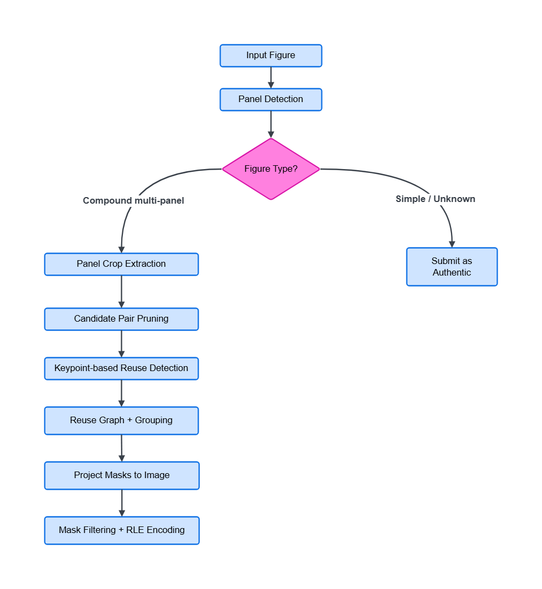

## Overview

Scientific figures come in different types, simple single-panel images and compound multi-panel figures. Many images in this competition were **compound figures** containing multiple panels -- microscopy images, gel blots, graphs, labels, and annotations arranged together.

Our approach: first understand the **structure** of the figure, then run reuse detection at the **panel level**. This kept the matching focused on actual scientific content rather than figure layout, labels, or borders.

Our solution focused on **inter-panel reuse detection** , comparing panels against each other within the same figure. We also planned **intra-panel copy-move detection** (forgery within a single panel), but this module was partially implemented and not completed in time for the final submission.

**Figure 1.** Inference pipeline. Panel detection runs first, then a figure type decision determines whether matching is needed. Compound multi-panel figures go through the full pipeline. All other figure types are predicted as authentic without running matching.

---

## Solution Details

### 1. Panel Detection

After reviewing the test set image and the article links provided by the competition host, it was clear that this was not a simple image forgery detection problem. Scientific figures are compound images with multiple panels, each representing a different experiment or condition. We decided early on to build a panel-first approach.

We used a **YOLOv5** panel detector (adapted from [ResearchIntegrity/panel-extractor](https://github.com/researchintegrity/panel-extractor)) to locate panels inside each figure. The model classifies panels into four types:  **Blots**,  **Microscopy**,  **Flow Cytometry**, and  **Graphs** .

After analyzing the dataset, we focused only on **Blots** and **Microscopy** panels. These were the panel types where forgery actually appeared in the competition data. Flow Cytometry and graph panels were skipped

**Figure 2.** Panel detection on two compound scientific figures. Red boxes show detected **Blot** panels (left), blue boxes show detected **Microscopy** panels (right), with confidence scores shown for each. These panel crops are used as the main units for pairwise reuse detection.

---

### 2. Figure Kind Classification

Before running any matching, we classified every figure into one of four types based on the panel detection output:

| Type                | Condition                              | Action                       |
| ------------------- | -------------------------------------- | ---------------------------- |
| `COMPOUND_MULTI`  | ≥ 2 Blot/Micro panels detected        | Run full matching pipeline   |
| `SIMPLE`          | 1 panel detected touching image edge   | Predict `authentic`, skip  |
| `COMPOUND_SINGLE` | 1 panel detected but not touching edge | Predict `authentic`, skip |
| `UNKNOWN`         | 0 panels detected                      | Predict `authentic`, skip  |

 

Only `COMPOUND_MULTI` figures went through the full pipeline. All other types were predicted as authentic.

Intra-panel copy-move detection (forgery within a single panel) was planned for `COMPOUND_SINGLE` , `SIMPLE` and `UNKNOWN` figures. The module was partially implemented but not completed in time for the final submission, so these figures were predicted as authentic.

---

### 3. Candidate Pruning

For compound multi-panel figures, we extracted all detected panel crops. Comparing every possible panel pair is expensive. We added a three-level pruning step before running the keypoint matcher:

**Level 1 -- Broad Grouping**
Panels were grouped by class (`blot`, `microscopy`, `other`). Matching was only performed within groups

**Level 2 -- Geometry Filter**
Pairs were rejected if aspect ratios or areas were too different to be copies.

**Level 3 -- CBIR Shortlisting**
All panels were embedded using ResNet-50. For each panel, only the top-K most similar panels proceeded to keypoint matching. We used `cbir_topk=3` for the final submission.

---

### 4. Inter-panel reuse detection

For each candidate panel pair, we ran keypoint-based matching to detect reused regions. The matcher is based on the [ResearchIntegrity/copy-move-detection-keypoint](https://github.com/researchintegrity/copy-move-detection-keypoint) project, extended with a Python API for pairwise cross-image matching and feature caching.

**Feature Extraction**
We used RootSIFT, which applies Hellinger normalization to SIFT descriptors. This improves matching quality for images with similar local textures, which is common in gel blots. Panels smaller than 300px on any side were upscaled before extraction to ensure enough keypoints.

**Flip Detection**
Features were extracted from both the original and horizontally mirrored panel. If the flipped match produced a larger shared region, that result was used instead.

**Geometric Verification**
Matched keypoints were verified using MAGSAC++, which is more robust than standard RANSAC against outliers, important for panels with repeated or noisy textures.

**Match Decision**
A pair was declared a match if it had ≥ 20 geometrically verified inlier keypoints. Shared area was estimated via convex hull over the matched keypoints.

---

### 5. Mask projection back to the original image Coordinates

The reuse detector produced masks in panel-crop coordinates. The competition required masks in original image coordinates.

For every matched crop mask, we projected it back to the full figure using the detected panel bounding box. This was a small but critical implementation detail, a reused region detected correctly at crop level will still score poorly if the final mask is misaligned in the original image.

---

### 6. Mask filtering and submission format

After grouping and projection, we applied a final filtering step before encoding the submission.

We removed masks smaller than 10 pixels, merged strongly overlapping masks, and dropped anything outside the image boundary. If no valid mask remained after filtering, the figure was submitted as `authentic`.

Otherwise, the remaining instance masks were RLE encoded into the competition submission format.

---

## Code

Code: [https://github.com/Nivratti/recodai-luc-sifd-4th-place-solution](https://github.com/Nivratti/recodai-luc-sifd-4th-place-solution)

The repository contains a cleaned and easier to setup version of our final inference pipeline. The public version focuses on the approach used for the competition submission and avoids unrelated post-competition experiments.

---

### What Worked

**Panel-first approach**
Processing figures at the panel level was the most important decision. Detecting panels first kept the matching focused on actual scientific content and avoided false matches from labels, borders, and figure layout.

**Skipping figures that didn't need matching**
We only ran the full pipeline on compound multi-panel figures. Simple, single-panel, and unknown figures were predicted as authentic without running any matching, as module to handle that figure types was not fully implemented. This significantly reduced false positives.

**Three-level candidate pruning**
Grouping panels by class, filtering geometrically incompatible pairs, and using CBIR to shortlist similar candidates before keypoint matching reduced computation.

**MAGSAC++ for geometric verification**
MAGSAC++ was more robust than standard RANSAC for panels with repeated or noisy textures, which is common in gel blots.

**Connected component grouping**
Grouping matched pairs into connected components avoided duplicate instance masks when the same reused content appeared across multiple panels.

**Modular architecture**
Keeping panel detection, keypoint matching, and CBIR as separate installable packages made it easy to benchmark and swap each component independently.

---

## What Did Not Work

### Direct full-image forgery detection

Directly running general image forgery detection models on the full image did not work well.

### Reducing image size too much during reuse detection

We tried reducing the maximum side length of panel images in reuse detection.

It reduced accuracy when the image size became too small. Keypoint-based matching depends on local visual details, and aggressive resizing can remove small structures that are useful for matching.

Because of this, we avoided resizing too aggressively in the reuse detection step.

### Treating all images the same

Using the same pipeline for every image was less reliable. The figure type decision step helped us avoid unnecessary predictions.

### Aggressive post-processing

Aggressive mask filtering or merging was risky.

If filtering was too strong, it could remove useful small masks. If merging was too aggressive, it will combine separate reused regions into one incorrect instance.

---

### Thanks and Acknowledgements

Thanks to Recod.ai, LUC, and the competition organizers for hosting this interesting and challenging competition.

This solution builds on two open source projects by [ResearchIntegrity](https://github.com/researchintegrity):

* [panel-extractor](https://github.com/researchintegrity/panel-extractor) — used as the base for panel detection
* [copy-move-detection-keypoint](https://github.com/researchintegrity/copy-move-detection-keypoint) — used as the base for keypoint matching

Thanks to the Kaggle community for useful discussions.
